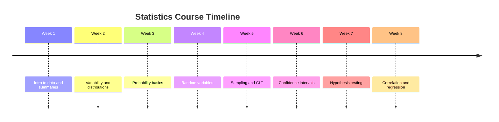

# Course Timeline

```mermaid
timeline
  title Statistics Course Timeline
  Week 1 : Intro to data and summaries
  Week 2 : Variability and distributions
  Week 3 : Probability basics
  Week 4 : Random variables
  Week 5 : Sampling and CLT
  Week 6 : Confidence intervals
  Week 7 : Hypothesis testing
  Week 8 : Correlation and regression
```

## Milestones

- Week 4: Mid-course check-in
- Week 8: Final revision session
